# Visit Zimbabwe Website

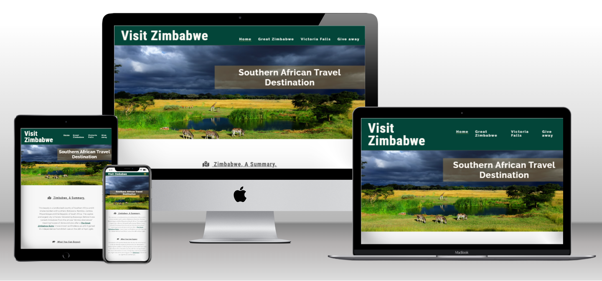

# Purpose

The goal of this website is to showcase what a beautiful country Zimabwe is for potential tourists who have visited the country before, hoping to do it for the first time and even introduce it to people from all over the globe looking to exploreAfrica, but have never heard of this beauty.

## Goal:

-Give a brief summary of the country
-have separate pages on the different tourist areas
-suggest other things outside of tourist places such as restaurants, clubs, pubs and spas for relation

[Here's a link to the live website](https://stacykimberley.github.io/project-one-visit-zimbabwe/)

# Featured Destinations

Explore our website featuring stunning destinations in Zimbabwe:

Victoria Falls
Great Zimbabwe Ruins

Other destinations will be added with time.

# UX Design 

## User Stories

### As a first time user:
<ul>
<li>I want the website to be appealing to the eye.</li>
<li>I want enough information to get me excited to visit, but not so much it would bore/ overwhelm me.</li>
<li>I want to be able to send a question and get an answer if I need additional information.</li>
<li>I want the information to be up to date and accurate</li>
<li>I want to see images of the places.</li>
<li>I want suggestions for restaurants, clubs and other fun places.</li>
</ul>

### As a returning user:

<ul>
<li>I want to find more areas and suggestions added each time I come back.</li>
<li>I want the information to be up to date and accurate.</li>
</ul>

The website should be accesible on different sized screens (bold)

# Structure

## Home Page 

### The home page will introduce the user to Zimbabwe as a country ie:
<ul>
 <li>Give information on where it is located in Africa.</li>
 <li>What tourists can expect to find when they visit.</li>
 <li>Summary on the what the weather is like with temperature ranges.</li>
 <li>Short introduction to zimbabwean culture, traditions and languages spoken.</li>
 <li>Gallery with images from different tourist places in Zimbabwe.</li>
 </ul>

## Great Zimbabwe Ruins Page

### This page will give the user:
<ul>
<li>An image of the ruins</li>
<li>The location of the monument.</li>
<li>Brief history of the place.</li>
<li>Summary of what a visitor should expect to find at the location.</li>
<li>Gallery with images from Great Zimbabwe Ruins.</li>
</ul>

## Victoria Falls Page

### This page will give the user:
<ul>
<li>An image of Victoria Falls.</li>
<li>The name in different languages and what they mean.</li>
<li>Summary of what a visitor should expect to find at the location.</li>
<li>Summary of activities and other things they can find in Victoria falls.</li>
<li>Gallery with images from Victoria Falls.</li>
</ul>

## Give Away Page

### Purpose:
<ul>
<li>Give a user an opportunity to send questions if they have any</li>
<li>User can sign up to monthly newsletter giving travel tips and suggestions</li>
<li>Incentive (15% discount) for users to sign up to the newsletter</li>
</ul>

## Wireframes 

### Home Page

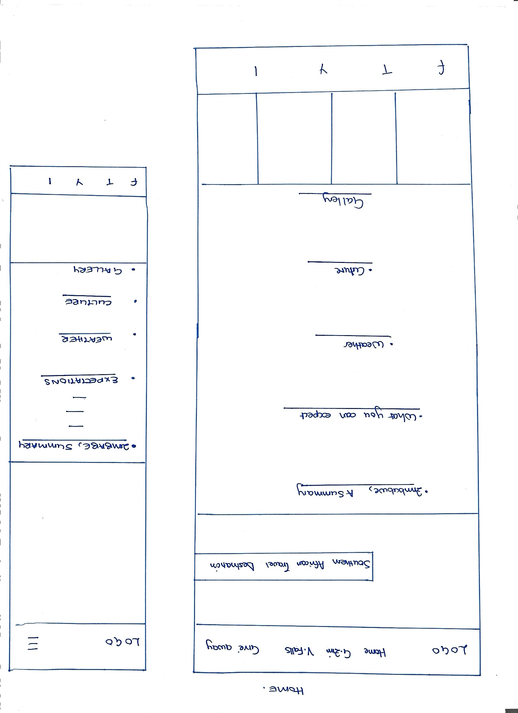

### Great Zimbabwe Page

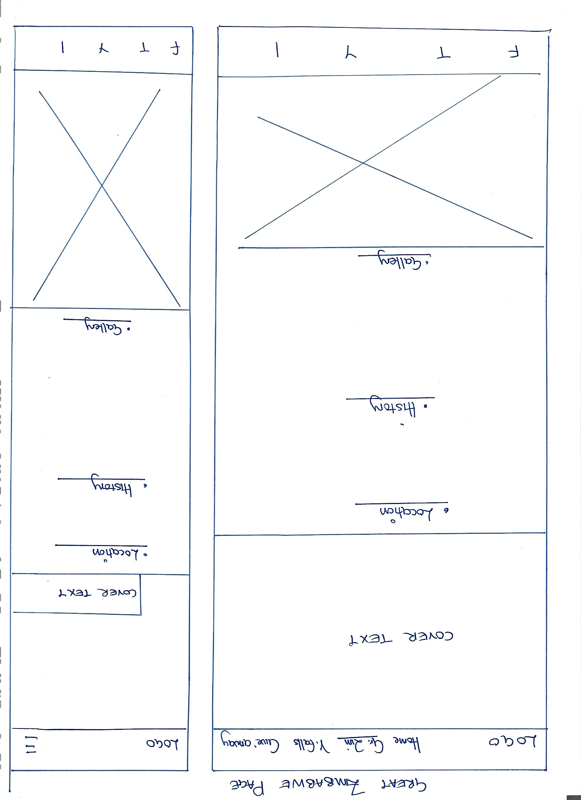

### Victoria Falls Page

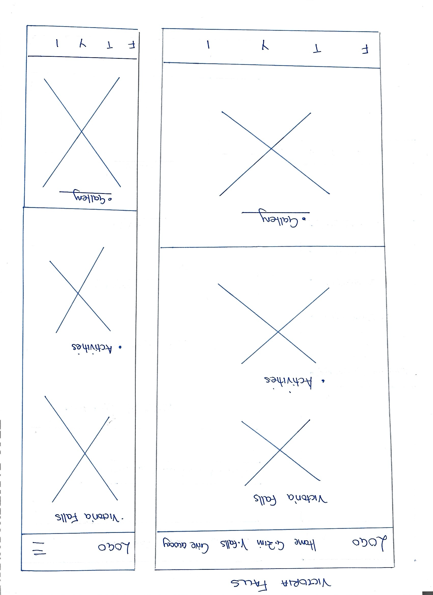

### Give Away Page

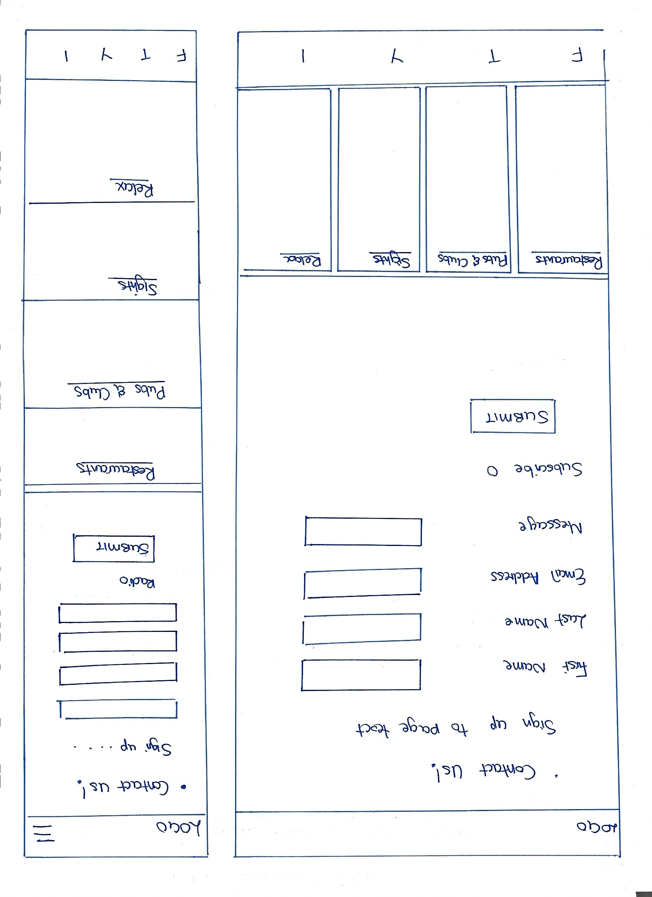

## Design

Initially, this website was supposed to only have one page with the content starting from home page and the other pages in that order, but was made into multiple pages each dedicated to a different subject so it would not be cluttered. The content for Great Zimbabwe, Victoria Falls, home page and sign up page was all different so it made sense to have a page dedicated with different styling. It also makes it easier as time goes and updates need to be made, to add them to their respective existing pages and create new ones with different themes for other new places. 

## Images

The images were found on Unsplash, Pexel and greatzimbabwe.com and the Zimbabwe Tourism Authority page.

## Colors

Not only do the green and yellow that colors are used match well with pictures of nature, but are also on the Zimbabwean flag. Initially white was going to be used, but a decision was made to use an off-white instead for backgrounds where there are no images.

## Fonts

"Pt Sans Narrow" is used for logo and headings and "Raleway" for paragraphs. Visually these fonts seem to go better together compared to "Josefin Sans" that was previously used for the logo and header, it seemed too serious for a website that's suggesting adventure and fun.

## Features

 ### Navigation Bar

 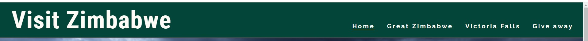

- Sticky navigation bar is on all 4 pages. It includes links to the Home page, Great Zimbabwe page, Victoria Falls page and Give away page to allow he user to easily navigate different pages of the website easily. The layout is identical on all pages.

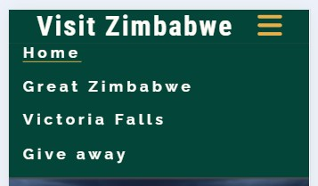

For mobile phones the nav bar is in a "hamburger menu" which extends to show all four links when clicked.

### Home Page Hero Image

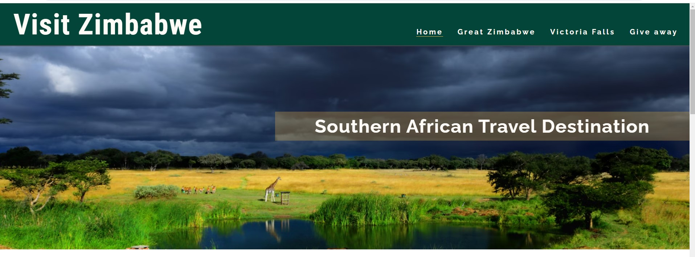

### Home Gallery

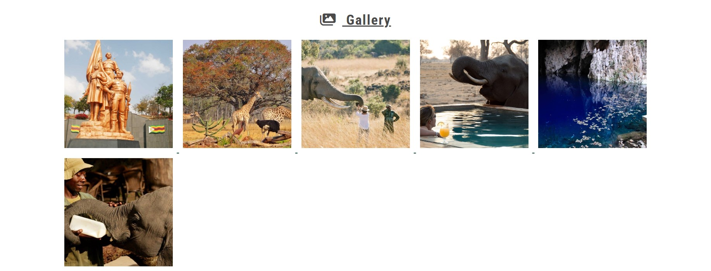

### Great Zimbabwe Hero Image

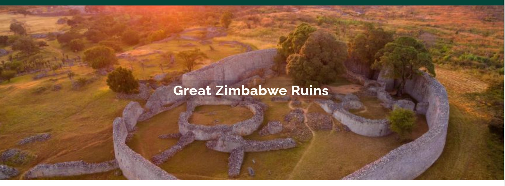

### Great Zimbabwe Gallery

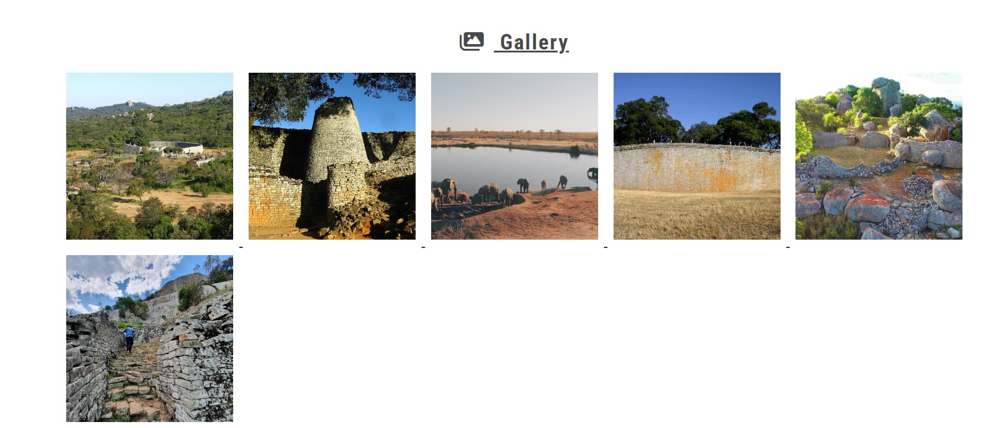

### Victoria Falls Hero 

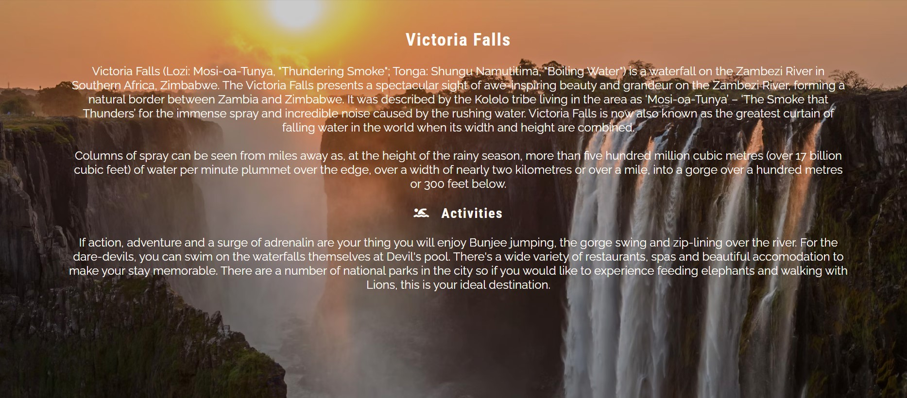

### Victoria Falls Hero 

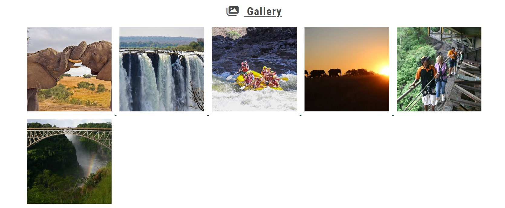

### Give Away Form & Suggestions

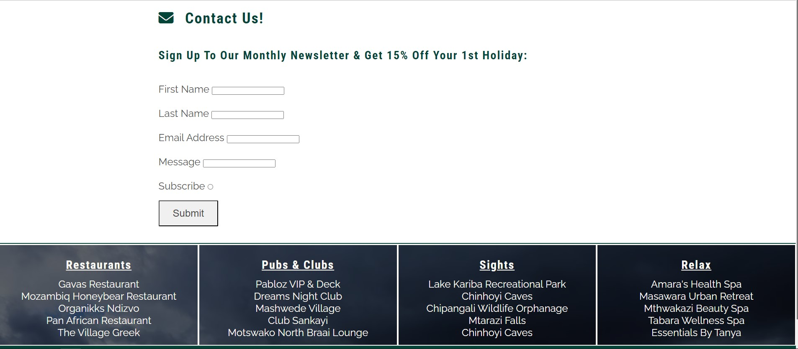

### Footer

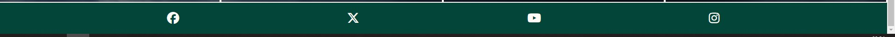

The footer includes links to Facebook, Twitter, Youtube and Instagram pages.

## Responsive Layout

The page is designed to responsive on all screen sizes starting from 344pixels for mobile phones, 768 pixels for tablets and greater than 992pixels so it's aesthetically pleasing for laptops and slightly larger screens.

## Technologies 

<ul>
<li>HTML for website structure</li>
<li>CSS to style website</li>
<li>GitHub to store the source code and GitHub Pages to deploy and host the live site</li>
<li>Gitpod chosen IDE to develop the website</li>
<li>Google Fonts</li>
<li>Font Awesome for icons</li>
<li>Google Chrome Dev Tools</li>
<li>Favicon.cc to choose favicons for all pages</li>
<li>Schemecolor to choose color palette</li>
<li>Techsini to create mockup of website on different iOS devices</li>
<li>Google chrome Lighthouse</li>
<li>Screen Reader for Google Chrome</li>
<li>Colorfilter</li>
<li>W3C HTML Markup Validator to validate HTML code</li>
<li>W3C Jigsaw CSS Validator to validate CSS code</li>
<li>Markdown Tables Generator to create user experience testing table</li>
<li>LibreOffice Calc to create tables</li>
<li>Code Institute's Gitpod Template to generate the workspace for the project</li>
<li>Code institute learning for general guidance </li>

## Testing 

### User Story Testing

### Feature Testing 

3 browsers were used to achieve this. See results below.

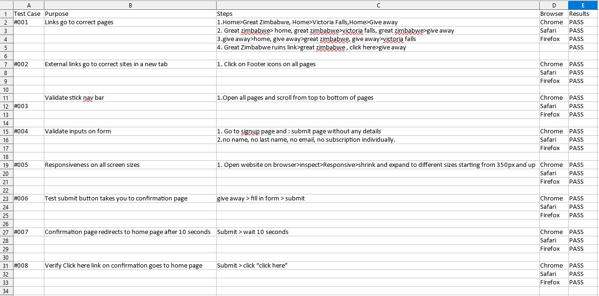

### Validator Testing 

#### HTML on [W3C Validator](https://validator.w3.org/nu/?doc=https%3A%2F%2Fcode-institute-org.github.io%2Flove-running-2.0%2Findex.html)
No errors or warnings were returned.

#### CSS on [Jigsaw Validator](https://jigsaw.w3.org/css-validator/)

Below errors were returned because of spaces in font names, no changes were made.
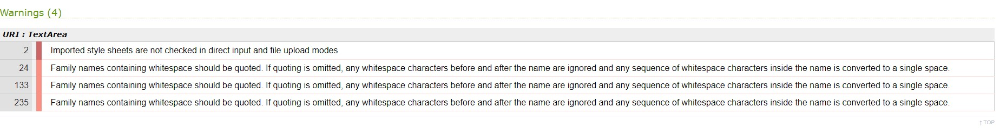

#### Google Lighthouse

**Homepage**

Mobile 

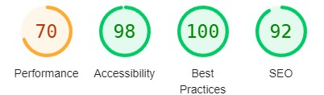

Desktop

**Great Zimbabwe**

Mobile 

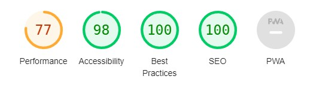

Desktop

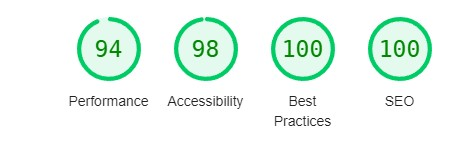

**Victoria Falls**

Mobile 

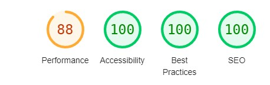

Desktop

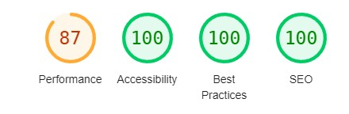

**Give away**

Mobile 

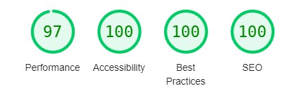

Desktop

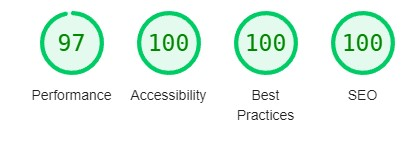

### Unfixed Bugs

Below errors were returned because of spaces in font names, no changes were made.

One font that was used for paragraphs has a space in the name which keeps returning errors. This has not been changed because that is the font name and if altered would ruin page aesthetics.

## Deployment

This project was deployed to GitHub pages. The steps to deploy are as follows:

1. Log into GitHub.
2. Select project-one-visit-zimbabwe from the list of repositories.
3. Select Settings From the Repositories sub-headings.
4. In the left side menu select Pages from Code and automation section.
5. Under the Source heading in the dropdown menu select main.
6. A second drop-down menu should remain with the default value /(root).
7. Press Save.
8. A message that the website is ready to be deployed will appear, refresh the page and the link to the deployed site will be available in a green sub-section on the top of the page.
9. Click on the link to go to the live deployed page.

[Here's a link to the live website](https://stacykimberley.github.io/project-one-visit-zimbabwe/)

How to run this project Locally

**Clone the repository**

1. Navigate to the GitHub Repository project-one-visit-zimbabwe.
2. Click the Code drop-down menu.
3. Click the HTTPS sub-heading under the Clone heading.
4. Copy the link.
5. Open an IDE of your choice (VSCode, Atom, Komodo, etc).
6. Open a terminal in the directory of your choice, type git clone and paste the link.
7. A clone of the repository will now be created on your machine.

**Download the repository manually**

1. Navigate to the GitHub Repository project-one-visit-zimbabwe.
2. Click the Code drop-down menu.
3. Click Download ZIP.
4. Locate the ZIP file and extract it to a folder where you want the repository to be stored.
5. Open an IDE of your choice (VSCode, Atom, Komodo, etc).
6. Navigate to the directory where the repository was extracted.
7. Now you will have the contents of the project available offline on your machine.

## Credits

### Content

- Inserts of Home page paragraphs, Great Zimbabwe paragraphs and Victoria falls paragraphs found on [ZTA Website](https://zimbabwetourism.net/)
- Inserts of Home page paragraphs, Great Zimbabwe paragraphs and Victoria falls paragraphs found on [Wikipedia](https://en.wikipedia.org/wiki/Zimbabwe)
- Deployment instructions found [here](https://github.com/oks-erm/sofing/)
- Structure of README.md found [here](https://github.com/Code-Institute-Solutions/readme-template?tab=readme-ov-file) and [here](https://github.com/oks-erm/sofing/).

### Media

- Home page hero image and Suggestons section background image by Benjamin Van Der Merwe from [Unsplash](https://unsplash.com/)
- Great Zimbabwe hero image by unnamed photographer from [Great Zimbabwe Ruins](http://www.greatzimbabweruins.com/)
- Victoria Falls hero image by Sammy Wong from [Unsplash](https://unsplash.com/)
- All gallery images by an unnamed photographer from [Zimbabwe Tourism Authority website](https://zimbabwetourism.net/)

### Code

- Gallery code taught by Hazel Hawadi.
- Code Snippet for Hamburger menu from Code Institute Love Running walk-through then modified.
- Flexbox code was aided by Code Institute Love Running walk-through then modified.
- Suggestions code was inspired by Code Institute IDE lessons and modified.
- Hero images and cover texts learnt from Code Institute IDE learnings and modified.
- Form code helped by Johnson Godwin and modified.

### Acknowledgements

I would like to express my gratitude to the following individuals for their contributions and support:

My mentor, Ronan McClelland for great support, advice, learning reasources and guidance throughout this project.

My sister Hazel Hawadi and partner Johnson Godwin for moral support and help with coding.

